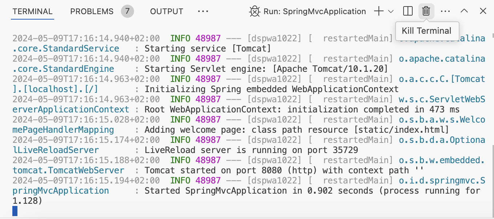

# Spring MVC

> Diese Anleitung basiert auf der Nutzung von VS Code wie in der Vorlesung vorgeschlagen. Wenn du eine andere IDE verwendest, funktionieren gewisse Kommandos unter Umständen anders.

## Starten der Anwendung

- Starte die Spring App, indem du [SpringMvcApplication.java](./SpringMvcApplication.java) öffnest und dort auf `Run` oberhalb der `main()`-Methode klickst
- Im _Terminal_ sollte die Anwendung starten
- Öffne [localhost:8080](http://localhost:8080) im Browser und du solltest eine _Welcome!_-Nachricht sehen
- Du kannst die Anwendung wieder stopppen, indem du den Prozess im Terminal über das _Mülltonnen_-Symbol beendest (siehe Screenshot)

> Immer, wenn du Änderungen an der Anwendung vornimmst, musst du die Anwendung stopppen und neu starten

## Aufgaben

> Ignoriere beim Bearbeiten zunächst die `Comment`-Klasse, den `CommentsController` sowie die `comments*.html`-Templates

- Mach dich zunächst mit dem [GreetingController](./GreetingController.java), der `greeting()`-Methode und dem dagehörigen [`greeting.html`](../../../../../resources/templates/greeting.html) vertraut
- Passe die `greeting()`-Methode an, mach den `name`-Parameter `required` und entferne das `defaultValue`.
  - Was passiert nun, wenn du den Endpunkt aufrufst?
  - Was passiert, wenn der Parameter nicht erforderlich ist _und_ kein Standardwert vorhanden ist?
- Erstelle einen weiteren Endpunkt unter `/posts` und verknüpfe es mit dem schon vorhandenen `posts.html`-Template. Setze zunächst keine Attribute.
  - Was wird im Browser angezeigt?
- Setze nun das Attribut `posts` auf eine `List<Post>`. Du kannst dafür die Methode `Post.samplePosts()` nutzen.
  - Was wird nun angezeigt?
- Schau dir die vorhandenen Templates genauer an. Welche Teile führen dazu, dass wir dynamische Inhalte wie die Liste der Posts anzeigen?
- Ergänze die `Post`-Klasse um neue Eigenschaften und zeige sie in der Tabelle an
- Nutze das gewonnene Wissen und erstelle nun ein komplett neues Template und einen neuen Endpunkt, welcher eine Liste von Usern ausgibt
- BONUS: Ergänze die `Post`-Klasse um einen `author` vom Typ `User` und gib seinen Namen in der Tabelle aus!
