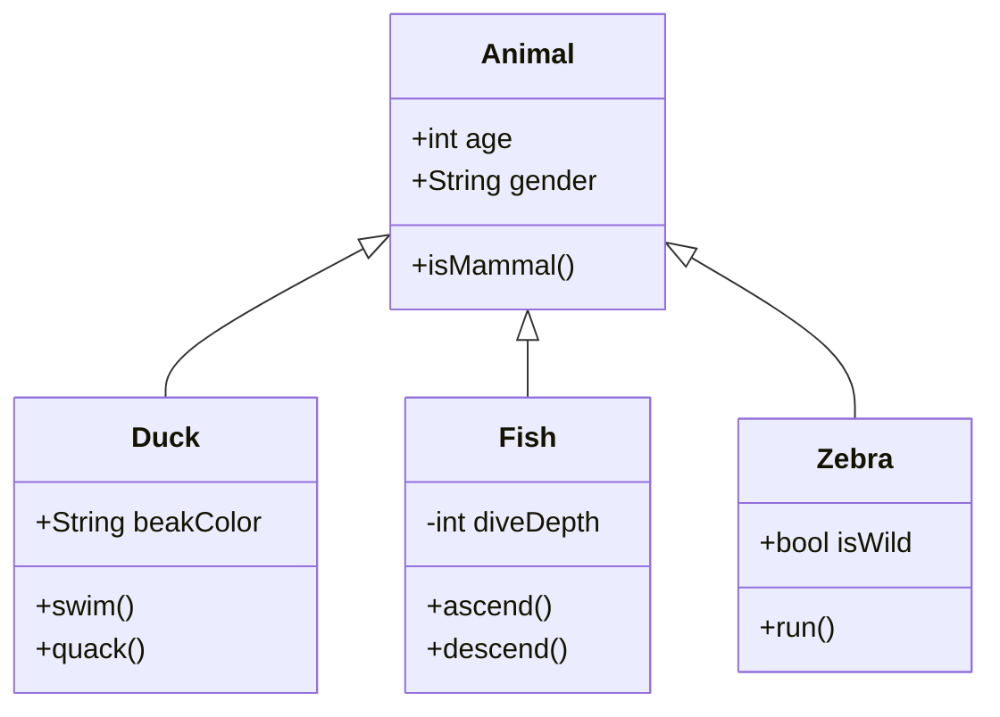

<ChallengeHeader index="12"/>



<div class="flex gap-6 absolute top-content right">
  <div class="flex flex-col items-center gap-2 duration-500" v-click>
    <div class="i-devicon-unifiedmodelinglanguage text-6xl"/>
    <a href="https://www.uml.org/" target="_blank">
      UML
    </a>
  </div>
</div>

<div class="absolute right bottom-content" v-click>

````md magic-move {at:3}
```java
final Duck dagobert = new Duck();
```

```java
final Duck dagobert = new Duck();

System.out.println(dagobert.age);
```

```java
final Duck dagobert = new Duck();

System.out.println(dagobert.age);
dagobert.swim();
```

```java
final Duck dagobert = new Duck();

System.out.println(dagobert.age);
dagobert.swim();

if (dagobert.isWild) {
  dagobert.run();
}
```

```java
final Duck dagobert = new Duck();

System.out.println(dagobert.age);
dagobert.swim();

final Zebra marty = new Zebra();

// Only zebras can run...
if (marty.isWild) {
  marty.run();
}

// But zebras are animals too...
System.out.println(marty.age);
```
````

</div>

<PageNumber/>
