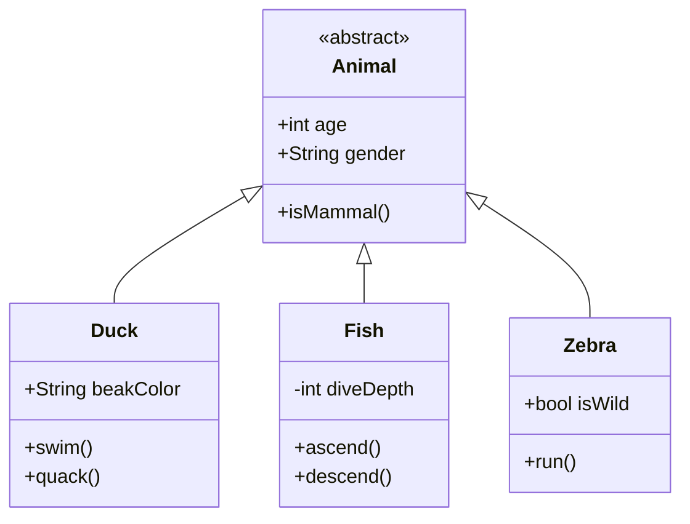
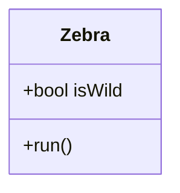

<ChallengeHeader index="13"/>

<div class="absolute right top-content-2 w-[21rem]" v-click.hide="4">



</div>

<div class="absolute right bottom-content" v-click="[4, 6]">



</div>

<div class="max-w-[35rem]">

````md magic-move
```java
// Animal.java
```

```java
public class Animal {

}
```

```java
public class Animal {

    public int age;
    public String gender;

    public Animal(int age, String gender) {
        this.age = age;
        this.gender = gender;
    }

}
```

```java
public abstract class Animal {

    public int age;
    public String gender;

    public Animal(int age, String gender) {
        this.age = age;
        this.gender = gender;
    }

    abstract boolean isMammal();

}
```
````

</div>

<div class="absolute right top-content-2 min-w-[18rem]">

````md magic-move
```java

```

```java
public class Zebra {

}
```

```java
public class Zebra extends Animal {

    public Zebra(int age, String gender) {
        super(age, gender);
    }

}
```

```java
public class Zebra extends Animal {

    public Zebra(int age, String gender) {
        super(age, gender);
    }

    @Override
    boolean isMammal() {
        return true;
    }

    void run() {
        System.out.println("Run!");
    }

}
```
````

</div>

<PageNumber/>
