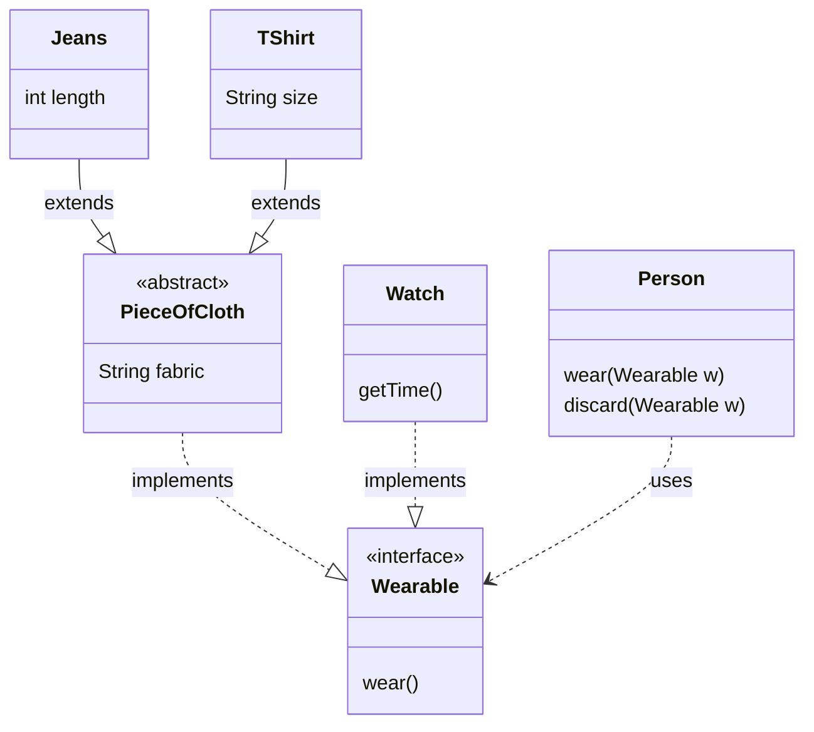

<Footer
    text="🎁 Objektorientierte Programmierung"
/>

# Interfaces <SubHeading text="Übersicht"/>

- Neben Klassen (`class`) gibt es auch definierte Schnittstellen (`interface`)
- Sie werden genutzt, um Gemeinsamkeiten und Fähigkeiten von Objekten zu beschreiben
- Sie dienen der Abstraktion und zur Bildung allgemeingültiger "Verträge"
- Je nach Anwendungsfall kann eine abstrakte Klasse oder ein Interface sinnvoller sein

<PageNumber/>
