<Footer
    text="🌍 Grundlagen betrieblicher Webanwendungen"
/>

# Grundlagen <SubHeading text="Motivation"/>

- Warum brauchen wir (Web-)Anwendungen?
  - Betriebliche Abläufe _ermöglichen_
  - Prozesse digitalisieren
  - Sämtliche Akteure sind digital unterwegs (privat und betrieblich)

```mermaid
flowchart LR
    c(🙋‍♀️ Customer)
    s(🤵‍♀️ Sales Agent)
    a(👨‍💼 Accounting)
    r{{Registration}}
    o{{Offer Creation}}
    oc{{Order Confirmation}}
    p{{Production}}
    sh{{Shipment}}
    i{{Invoice}}

    c -.- r
    c -.- oc
    a -.- i
    s -.- o

    r --> o
    o --> oc
    oc --> p
    p --> sh
    sh --> i
```

<Figcaption>Beispiel-Prozess: CRM-System / Sales</Figcaption>

<PageNumber/>
