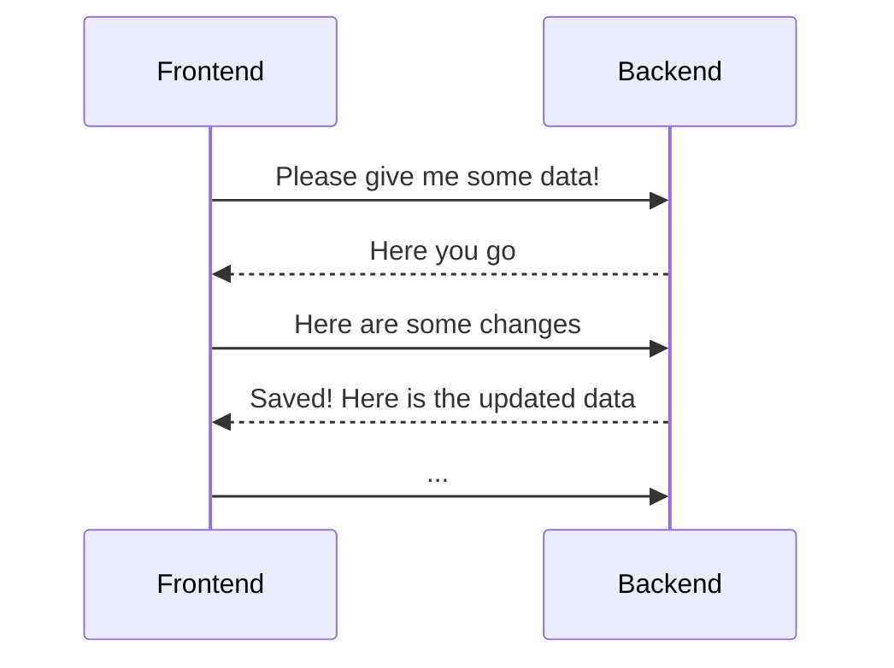

<Footer
    text="🌍 Grundlagen betrieblicher Webanwendungen"
/>

# Client-Server-Architektur <SubHeading text="Klassiches Modell"/>

- Eine klassische Webanwendung arbeitet nach dem Client-Server-Modell
- Das **Frontend** läuft auf dem Gerät der Nutzenden, visualisiert Daten und nimmt Eingaben entgegen
- Das **Backend** ist ein Server, der über eine Schnittstelle (API) Daten entgegennehmen und ausgeben kann

<PageNumber/>
