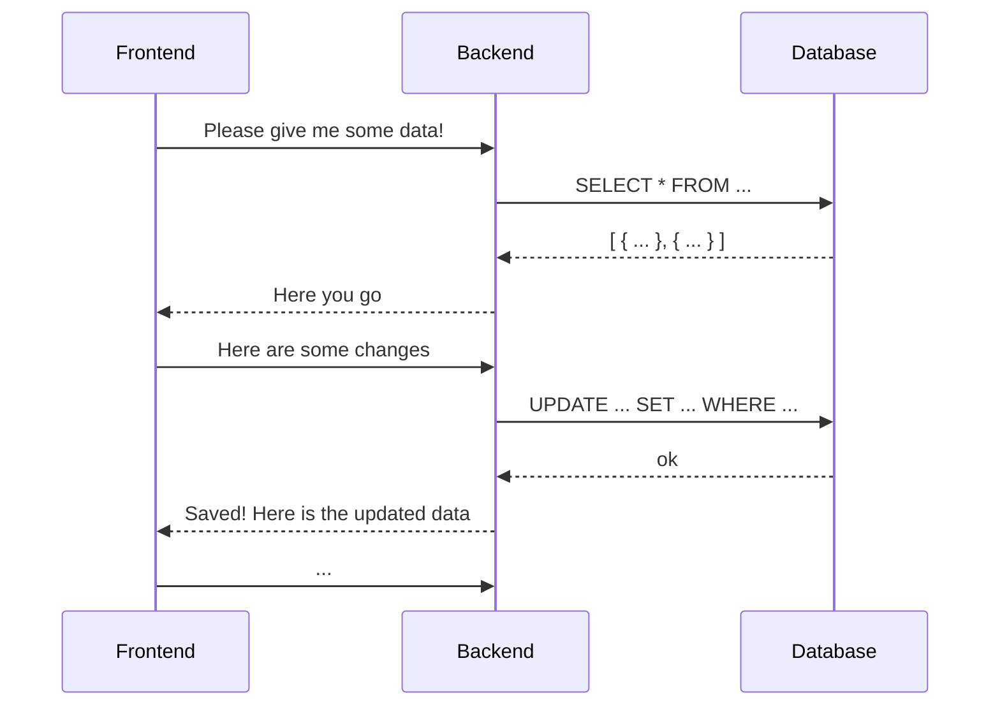

<Footer
    text="🌍 Grundlagen betrieblicher Webanwendungen"
/>

# Client-Server-Architektur <SubHeading text="Klassiches Modell"/>

- Das **Backend** übernimmt üblicherweise die geschützte Kommunikation mit Datenquellen und anderen angeschlossenen Diensten
- So hat das **Frontend** keinen direkten Zugriff auf die Datenquellen; so werden üblicherweise Berechtigungssysteme umgesetzt

<PageNumber/>
