<Footer
    text="🌍 Grundlagen betrieblicher Webanwendungen"
/>

# Client-Server-Architektur <SubHeading text="Architektur"/>

- In der Regel gibt es _viele Clients_, die über das **Frontend** auf _eine oder wenige Serverinstanzen_ zugreifen
- Häufig gibt es für dieselbe Webanwendung auch mehrere **Frontends**, beispielsweise im Browser und als mobile App (z.B. YouTube, AirBnB, ...)
  - Im Optimalfall kann dieselbe API des **Backends** wiederverwendet werden

```mermaid
flowchart TD
    a(🖥️ Client A)
    b(🖥️ Client B)
    c(📱 Client C)
    x(...)
    s{{Server}}
    db[(Database)]
    api{{External API}}

    a <---> s
    b <---> s
    c <---> s
    x <---> s
    s <-.-> db
    s <-..-> api
```

<PageNumber/>
