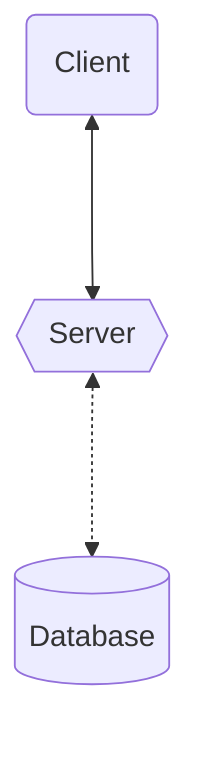

<Footer
    text="🌍 Grundlagen betrieblicher Webanwendungen"
/>

# Client-Server-Architektur <SubHeading text="Technologien"/>

- Das **Backend** ist eine serverseitige Anwendung, die in vielen verschiedenen Sprachen und Frameworks umgesetzt werden kann (_Java_, _JS_, _Python_, _Rust_, _Go_, _C_/_C++_/_C#_, ...)
- Im **Browser** ist der Technologiestack im Kern derselbe: _HTML_, _CSS_, _JavaScript_
- Im **Datenbankbereich** hängt die Technologieauswahl maßgeblich von der Art der Daten und den Anforderungen ab (relational, Graphen, dokumentenbasiert, ...)

...

...

<PageNumber/>
