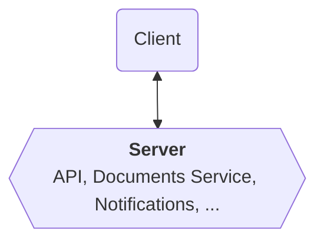
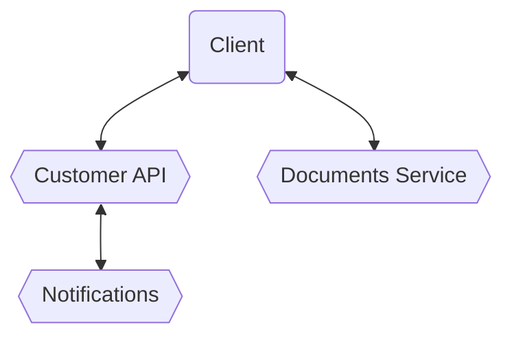

<Footer
    text="🌍 Grundlagen betrieblicher Webanwendungen"
/>

# Architekturen <SubHeading text="Microservices"/>

- Die bisherigen Beispiele zeigten ein _monolithisches Modell_, bei dem es _einen_ Server gibt, der sämtliche Aufgaben bewältigt
- Alternativ dazu kann man die Bestandteile einer Anwendung aufteilen, dann spricht man von _Microservices_

<Figcaption>Beispiel für die monolithische Architektur</Figcaption>

<Figcaption>Beispiel für eine Microservice-Architektur</Figcaption>

<PageNumber/>
