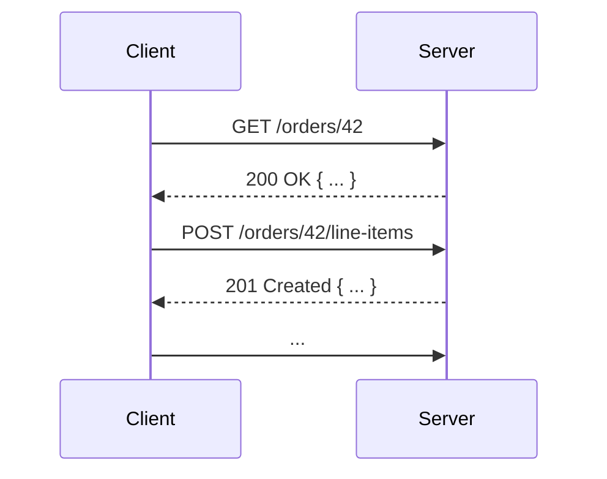

<Footer
    text="🌍 Grundlagen betrieblicher Webanwendungen"
/>

# Request-Response

- Klassicherweise interargieren _Client_ und _Server_ im _Request-Response_-Modus, also auf eine Anfrage folgt eine Antwort
- In der Regel erfolgt diese Kommunikation über [HTTP](https://developer.mozilla.org/en-US/docs/Web/HTTP)
  - Auf HTTP basieren verschiedene Verfahren wie [REST](https://developer.mozilla.org/en-US/docs/Glossary/REST) oder [GraphQL](https://graphql.org/)

<Figcaption>Interaktion über eine REST-API</Figcaption>

<PageNumber/>

<!--
**REST: Representational State Transfer**

The basic idea of REST is that a resource, e.g. a document, is transferred via well-recognized, language-agnostic, and reliably standardized client/server interactions. Services are deemed RESTful when they adhere to these constraints.
-->
