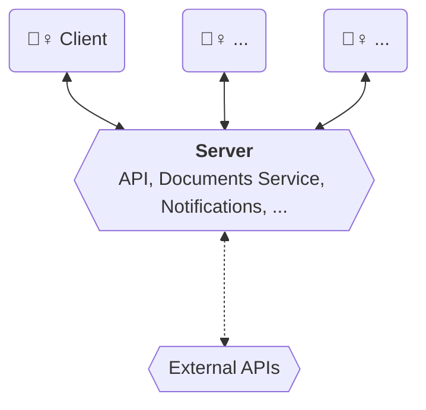

<Footer
    text="🌍 Grundlagen betrieblicher Webanwendungen"
/>

# Monolith <SubHeading text="Architekturen"/>

- Die bisherigen Beispiele zeigten ein _monolithisches Modell_, bei dem es _einen_ Server gibt, der sämtliche Aufgaben bewältigt
- Vorteile
  - Einfache Code-Basis und einfacher Betrieb
  - Einfaches Testing
- Nachteile
  - Skaliert nur als Ganzes
  - Möglicherweise nicht _stateless_ und damit nicht horizontal skalierbar

<Figcaption>Beispiel für die monolithische Architektur</Figcaption>

<PageNumber/>
