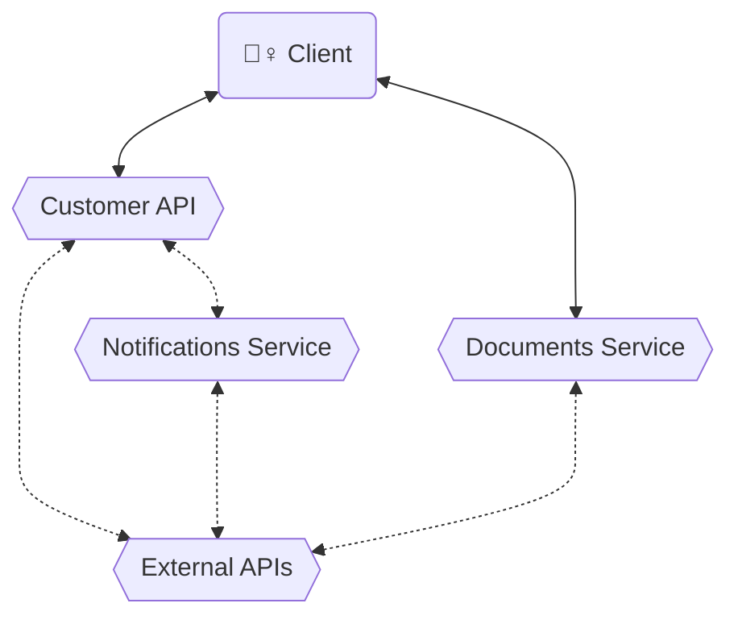

<Footer
    text="🌍 Grundlagen betrieblicher Webanwendungen"
/>

# Microservices <SubHeading text="Architekturen"/>

- Alternativ kann man die verschiedenen Bestandteile der Anwendung aufteilen
- Vorteile
  - Services individuell skalierbar (horizontal & vertikal)
  - Modularität / Fehlerisolation
  - Technologische Unabhängigkeit
- Nachteile
  - Komplexeres Setup (Repository, Deployment, Hosting, Netzwerk)
  - Integrationstests unter Umständen schwierig
  - Komplexeres Loggng/Tracing

<Figcaption>Beispiel für eine Microservice-Architektur</Figcaption>

<PageNumber/>
