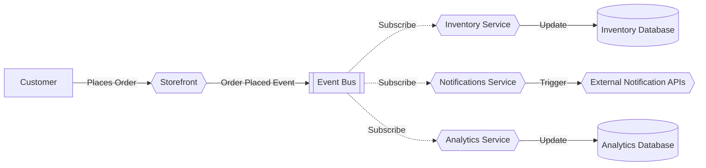

<!-- <Footer
    text="🌍 Grundlagen betrieblicher Webanwendungen"
/> -->

# Event-Driven <SubHeading text="Architekturen"/>

- Bei den bisherigen Architekturen kommunizieren die Dienste direkt (_Request-Response_) miteinander und sind dadurch voneinander abhängig
- Alternativ kann das Zusammenspiel der Services _eventbasiert_ aufgebaut werden
- Daten werden in _Event-Streams_ gehalten und interessierte Services _abonnieren_ den jeweiligen Stream
- Die Dienste sind dadurch unabhängig und bspw. auch resistent gegen den Ausfall einzelner Dienste
- Beispiel: [Apache Kafka](https://kafka.apache.org/)

<Figcaption>Beispiel für eine Event-Driven-Architektur</Figcaption>

<PageNumber/>
