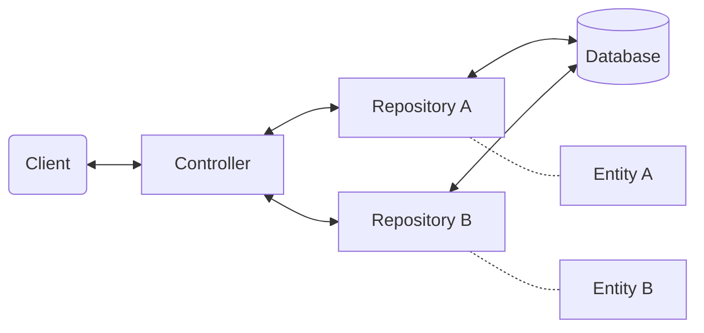

<Footer
    text="☕️ Java-Web-Technologien"
/>

# MVC + Data <SubHeading text="Spring Framework"/>

- Mit _Spring MVC_ können wir nun einfache datengetriebene Webseiten zu bauen
- Mit _Spring Data_ können wir Daten persistent speichern
- Durch Verknüpfen beider Konzepte können wir nun bereits eine voll funktionsfähige App bauen

<PageNumber/>
