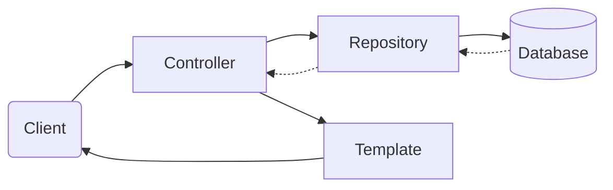

<Footer
    text="☕️ Java-Web-Technologien"
/>

# MVC + Data <SubHeading text="Spring Framework"/>

- Die _Templates_ stellen die Listenansicht und das Formular bereit
- Der _Controller_ verarbeitet die Anfragen und kommuniziert mit den _Repositories_
- Die _Repositories_ lesen und schreiben die Daten

<PageNumber/>
