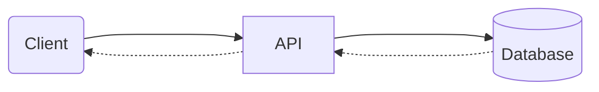

<Footer
    text="☕️ Java-Web-Technologien"
/>

# Datenbanken <SubHeading text="Grundlagen"/>

- Bisher haben wir eine _In-Memory_ Datenbank ([_H2_](https://www.h2database.com/html/main.html)) verwendet
  - Vorteil: Einfache Integration ins Projekt, keine weitere Infrastruktur notwendig
  - Nachteil: Daten sind nach Stop der Anwendung verloren
- In einer echten Anwendung müssen die Daten vorhanden bleiben, daher trennt man Datenbank und Anwendung voneinander

<PageNumber/>
