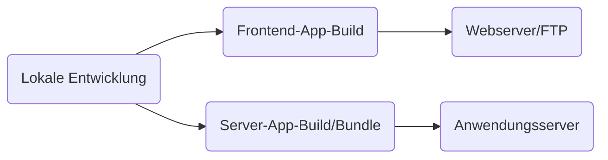

# Diverses <SubHeading text="Web App Deployment"/>

- Wie bekomme ich eine Web-App (Frontend und/oder Server) von meinem lokalen Entwicklungs-Rechner ins Internet/in die Cloud?

- **Lokale Entwicklung:** z.B. Vite, Angular CLI (ng serve), ...
- **Webserver/FTP:** z.B. Webhosting-Anbieter (IONOS, Strato, ...), XAMPP auf lokaler Infrastruktur, Docker
- **Anwendungsserver:** z.B. Docker, Google App Engine, Cloud Functions, ...
- **Automatisierung:** z.B. Github Actions, Jenkins, Google Cloud Build, ...

<PageNumber/>
