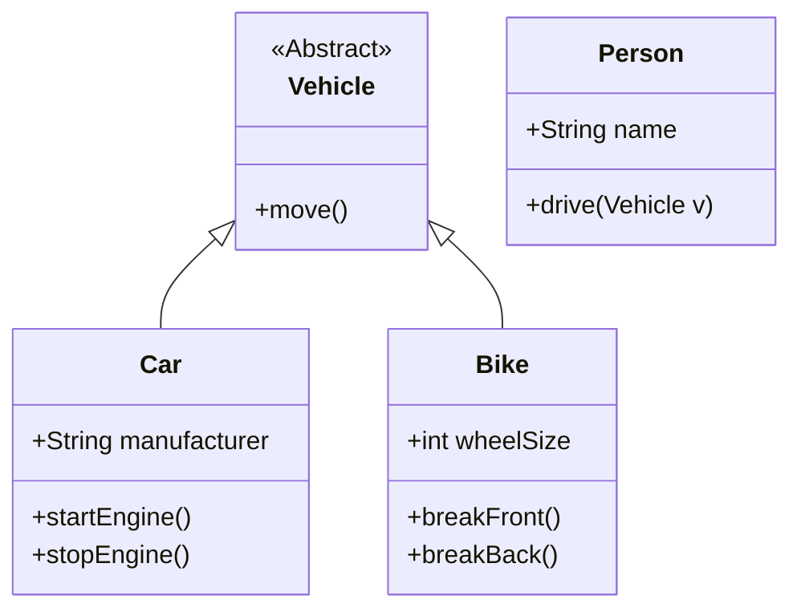

<Footer
    text="🎁 Objektorientierte Programmierung"
/>

# Was bedeutet "objektorientiert"?

- Einteilung von Aufgaben/Dingen der "echten Welt" in kontrollierbare Teile (= Objekte)
- Es gibt verschiedene Typen von Objekten, also verschiedene Klassen (`class`)
- In ein System/Programm existieren Objekte verschiedener Klassen und interargieren miteinander

<PageNumber/>
