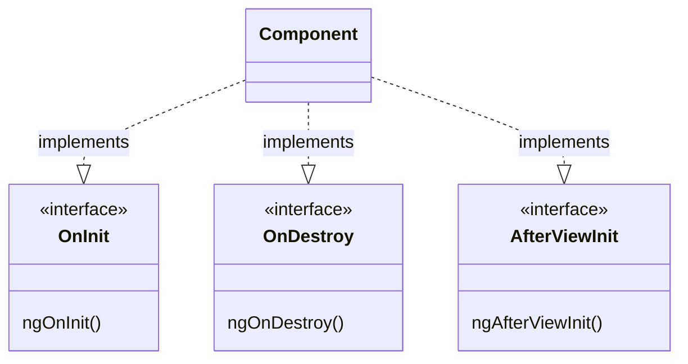

<Footer
    text="🎁 Objektorientierte Programmierung"
/>

# Interfaces

- Interfaces werden in Anwendungen auch genutzt, damit Komponenten an gewissen "Lifecycle-Events" teilnehmen können
- Beispiele finden sich in vielen Frameworks
  - [Svelte](https://svelte.dev/docs/svelte#onmount)
  - [Angular](https://angular.io/guide/lifecycle-hooks#lifecycle-event-sequence)
  - [NestJS](https://docs.nestjs.com/fundamentals/lifecycle-events)
  - [Spring Boot](https://docs.spring.io/spring-framework/reference/core/beans/annotation-config/postconstruct-and-predestroy-annotations.html)
  - ...

    Ausschnitt aus den
    <a href="https://angular.io/guide/lifecycle-hooks#lifecycle-event-sequence" target="_blank">
        Angular Lifecycle Hooks
    </a>

<PageNumber/>
