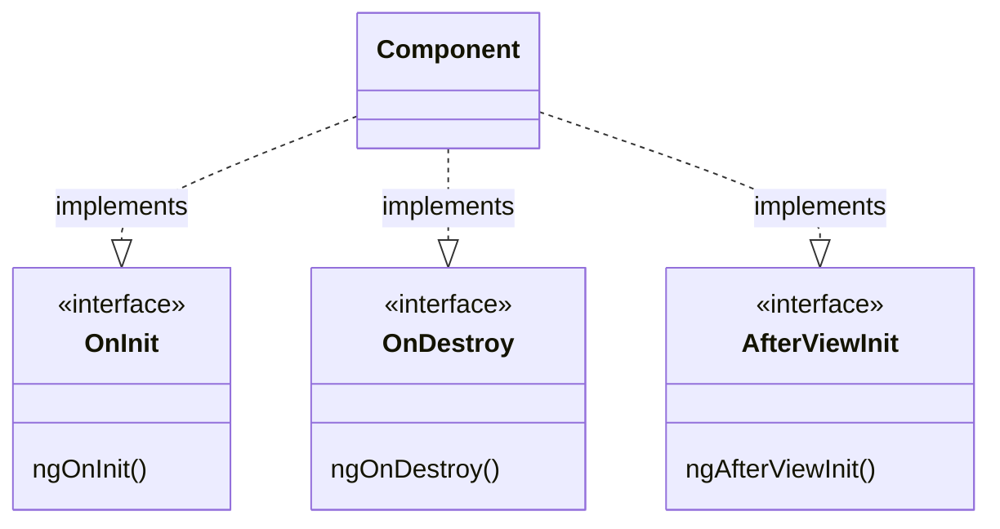

<Footer
    text="🎁 Objektorientierte Programmierung"
/>

# Interfaces

<div class="grid grid-cols-12 gap-6">
<div class="col-span-6">

```ts twoslash
import { Component, OnInit, Input } from "@angular/core";

@Component({
  template: `{{ a }} + {{ b }} = {{ result }}`,
})
export class AdderComponent implements OnInit {
  @Input()
  a?: number;

  @Input()
  b?: number;

  result?: number;

  ngOnInit() {
    this.result = (this.a ?? 0) + (this.b ?? 0);
  }
}
```

</div>
<div class="col-span-6">



<span class="text-sm absolute right bottom-30">
    Ausschnitt aus den
    <a href="https://angular.io/guide/lifecycle-hooks#lifecycle-event-sequence" target="_blank">
        Angular Lifecycle Hooks
    </a>
</span>

</div>
</div>

<PageNumber/>
